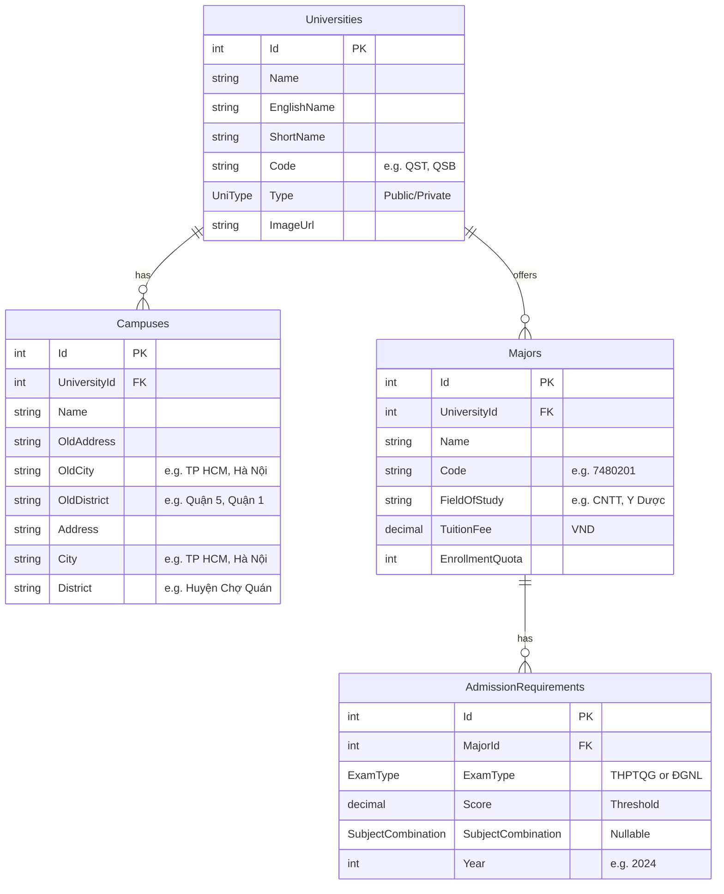

```mermaid
erDiagram
    Universities ||--o{ Campuses : "has"
    Universities ||--o{ Majors : "offers"
    Majors ||--o{ AdmissionRequirements : "has"

    Universities {
        int Id PK
        string Name
        string EnglishName
        string ShortName
        string Code "e.g. QST, QSB"
        UniType Type "Public/Private"
        string ImageUrl
    }

    Campuses {
        int Id PK
        int UniversityId FK
        string Name
        string OldAddress
        string OldCity "e.g. TP HCM, Hà Nội"
        string OldDistrict "e.g. Quận 5, Quận 1"
        string Address
        string City "e.g. TP HCM, Hà Nội"
        string District "e.g. Huyện Chợ Quán"

    }

    Majors {
        int Id PK
        int UniversityId FK
        string Name
        string Code "e.g. 7480201"
        string FieldOfStudy "e.g. CNTT, Y Dược"
        decimal TuitionFee "VND"
        int EnrollmentQuota
    }

    AdmissionRequirements {
        int Id PK
        int MajorId FK
        ExamType ExamType "THPTQG or ĐGNL"
        decimal Score "Threshold"
        SubjectCombination SubjectCombination "Nullable"
        int Year "e.g. 2024"
    }
```    