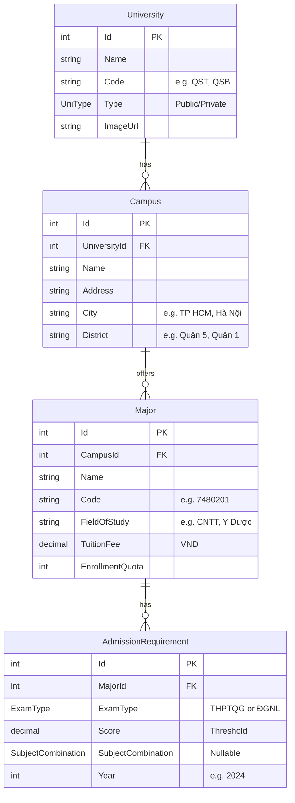

```mermaid
erDiagram
    University ||--o{ Campus : "has"
    Campus ||--o{ Major : "offers"
    Major ||--o{ AdmissionRequirement : "has"

    University {
        int Id PK
        string Name
        string Code "e.g. QST, QSB"
        UniType Type "Public/Private"
        string ImageUrl
    }

    Campus {
        int Id PK
        int UniversityId FK
        string Name
        string Address
        string City "e.g. TP HCM, Hà Nội"
        string District "e.g. Quận 5, Quận 1"
    }

    Major {
        int Id PK
        int CampusId FK
        string Name
        string Code "e.g. 7480201"
        string FieldOfStudy "e.g. CNTT, Y Dược"
        decimal TuitionFee "VND"
        int EnrollmentQuota
    }

    AdmissionRequirement {
        int Id PK
        int MajorId FK
        ExamType ExamType "THPTQG or ĐGNL"
        decimal Score "Threshold"
        SubjectCombination SubjectCombination "Nullable"
        int Year "e.g. 2024"
    }
```    