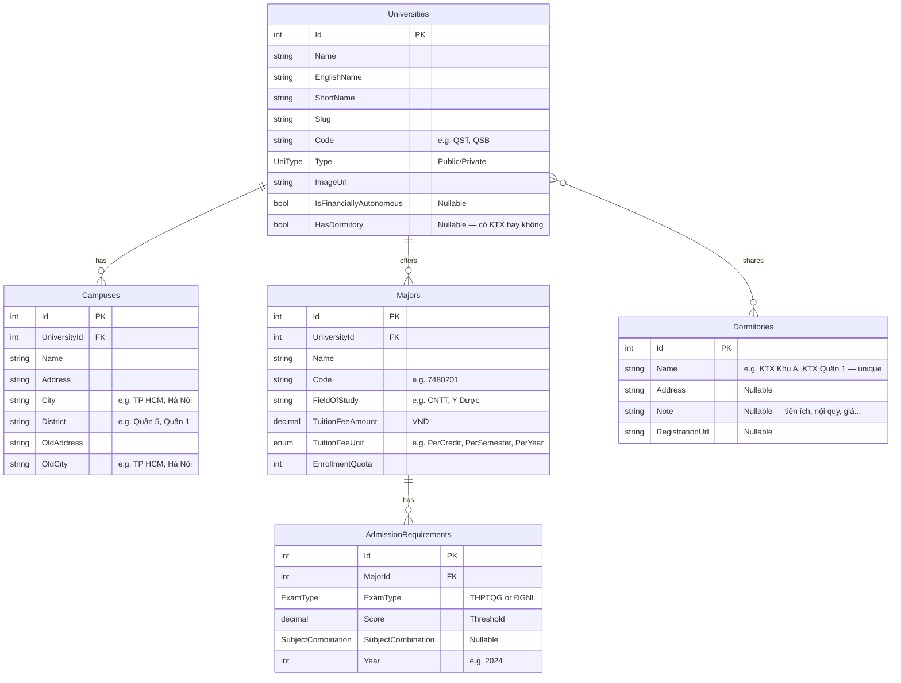

```mermaid
erDiagram
    Universities ||--o{ Campuses : "has"
    Universities ||--o{ Majors : "offers"
    Universities }o--o{ Dormitories : "shares"
    Majors ||--o{ AdmissionRequirements : "has"

    Universities {
        int Id PK
        string Name
        string EnglishName
        string ShortName
        string Slug
        string Code "e.g. QST, QSB"
        UniType Type "Public/Private"
        string ImageUrl
        bool IsFinanciallyAutonomous "Nullable"
        bool HasDormitory "Nullable — có KTX hay không"
    }

    Dormitories {
        int Id PK
        string Name "e.g. KTX Khu A, KTX Quận 1 — unique"
        string Address "Nullable"
        string Note "Nullable — tiện ích, nội quy, giá..."
        string RegistrationUrl "Nullable"
    }

    Campuses {
        int Id PK
        int UniversityId FK
        string Name
        string Address
        string City "e.g. TP HCM, Hà Nội"
        string District "e.g. Quận 5, Quận 1"
        string OldAddress
        string OldCity "e.g. TP HCM, Hà Nội"
    }

    Majors {
        int Id PK
        int UniversityId FK
        string Name
        string Code "e.g. 7480201"
        string FieldOfStudy "e.g. CNTT, Y Dược"
        decimal TuitionFeeAmount "VND"
        enum TuitionFeeUnit "e.g. PerCredit, PerSemester, PerYear"
        int EnrollmentQuota
    }

    AdmissionRequirements {
        int Id PK
        int MajorId FK
        ExamType ExamType "THPTQG or ĐGNL"
        decimal Score "Threshold"
        SubjectCombination SubjectCombination "Nullable"
        int Year "e.g. 2024"
    }
```    