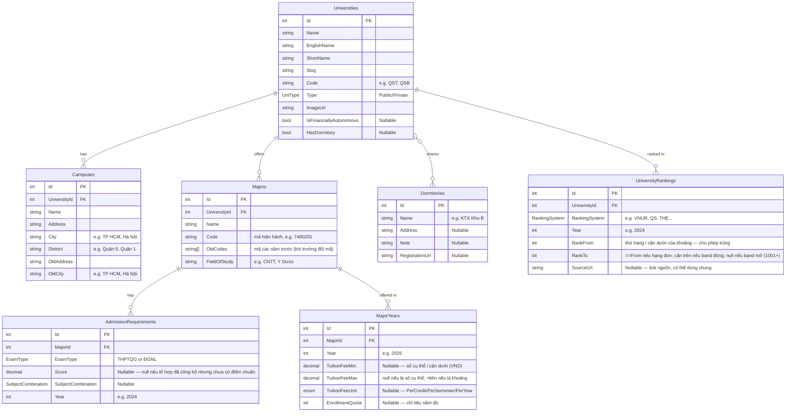

```mermaid
erDiagram
    Universities ||--o{ Campuses : "has"
    Universities ||--o{ Majors : "offers"
    Universities }o--o{ Dormitories : "shares"
    Universities ||--o{ UniversityRankings : "ranked in"
    Majors ||--o{ AdmissionRequirements : "has"
    Majors ||--o{ MajorYears : "offered in"

    Universities {
        int Id PK
        string Name
        string EnglishName
        string ShortName
        string Slug
        string Code "e.g. QST, QSB"
        UniType Type "Public/Private"
        string ImageUrl
        bool IsFinanciallyAutonomous "Nullable"
        bool HasDormitory "Nullable"
    }

    Dormitories {
        int Id PK
        string Name "e.g. KTX Khu B"
        string Address "Nullable"
        string Note "Nullable"
        string RegistrationUrl "Nullable"
    }

    Campuses {
        int Id PK
        int UniversityId FK
        string Name
        string Address
        string City "e.g. TP HCM, Hà Nội"
        string District "e.g. Quận 5, Quận 1"
        string OldAddress
        string OldCity "e.g. TP HCM, Hà Nội"
    }

    Majors {
        int Id PK
        int UniversityId FK
        string Name
        string Code "mã hiện hành, e.g. 7480201"
        string[] OldCodes "mã các năm trước (khi trường đổi mã)"
        string FieldOfStudy "e.g. CNTT, Y Dược"
    }

    MajorYears {
        int Id PK
        int MajorId FK
        int Year "e.g. 2026"
        decimal TuitionFeeMin "Nullable — số cụ thể / cận dưới (VND)"
        decimal TuitionFeeMax "null nếu là số cụ thể; >Min nếu là khoảng"
        enum TuitionFeeUnit "Nullable — PerCredit/PerSemester/PerYear"
        int EnrollmentQuota "Nullable — chỉ tiêu năm đó"
    }

    AdmissionRequirements {
        int Id PK
        int MajorId FK
        ExamType ExamType "THPTQG or ĐGNL"
        decimal Score "Nullable — null nếu tổ hợp đã công bố nhưng chưa có điểm chuẩn"
        SubjectCombination SubjectCombination "Nullable"
        int Year "e.g. 2024"
    }

    UniversityRankings {
        int Id PK
        int UniversityId FK
        RankingSystem RankingSystem "e.g. VNUR, QS, THE..."
        int Year "e.g. 2024"
        int RankFrom "thứ hạng / cận dưới của khoảng — cho phép trùng"
        int RankTo "==From nếu hạng đơn; cận trên nếu band đóng; null nếu band mở (1001+)"
        string SourceUrl "Nullable — link nguồn, có thể dùng chung"
    }
```    